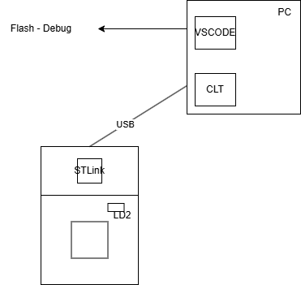
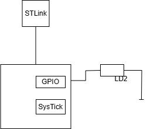
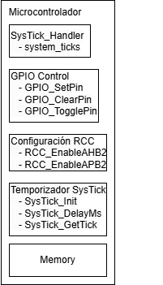

# Documentation mid_term_exam_24_2
## AUthor
Cristian Camilo Osorio Mesa

---

## Introducción

Primer exámen de la asignatura de Estructuras computacionales. Se reescribio la mayor parte del código por mo propia comodidad, puesto que el código suministrado no me funcionó el dia del exámen.
Suspendí la funcionalidad UART puesto que todavía estoy comprendiendo su implementación.

### Descripción general:
El programa usa el Temporizador de Sistema(SysTick) para medir el tiempo y manipular los pines de entrada y salida de uso general(GPIOs) para controlar un sistema de control de acceso. Inicialmente se tenía planeado complementar este funcionamiento con comunicación serial para poder agregar la funcionalidad de controlar el acceso por medio de USART.

---

## Contexto y entorno

Para la implementación del programa se usa la tarjeta de desarrollo NUCLEO-L476RG, la cual posee el microcontrolador STM32L476RG, un chip de comunicación y debugging compatible con STLink, el botón y uno de los LEDs necesitados. El otro LED, usado para indicar el estado de la puerta, se conectó de manera externa al pin 4 del GPIOA.

<div style = "text-align: center;">
    
</div>

Además, para la parte de cargar y debugguear (Flash - Debug)el programa se usó un ordenador con CLT y VSCODE.

---

## Arquitectura del sistema

<div style = "text-align: center;">
    
</div>

El microcontrolador, según va corriendo el programa y se activa la interrupción de Systick, usa los pines GPIO para manipular el estado de salida del LED que contiene la tarjeta de desarrollo y el LED conectado de forma externa. El LED de la tarjeta(LD2) es utilizado para saber que el programa sigue corriendo, parpadéa cada 500 ms. El botón azul, también de la tarjeta, es usado para mandar una interrupción, la cual hace que el control de acceso cambie su estado.

---

## Componentes y módulos

<div style = "text-align: center;">
    
</div>

El microcontrolador se encarga de manejar el Systick y sus interrupciones, controlar el pin GPIO correspondiente al LED de la tarjeta Nucleo(LD2), manejar la memoria y configurar los relojes del sistema.

---

## Implementación

Lo primero que se hace en el programa es importar todos los módulos necesarios para el funcionamiento del mismo.

```c
#include <stdint.h>
#include "systick.h"
#include "exti.h"
#include "gpio.h"
```

En estos módulos están definidos las funciones, tipos, estructuras y constantes necesarias para el funcionamiento del programa.

A continuación se definen algunas constantes globales para el programa del control de acceso:

```c
#define TEMP_UNLOCK_DURATION 5000 // Duration in ms for temporary unlock

typedef enum {
    LOCKED,
    TEMP_UNLOCK,
    PERM_UNLOCK
} DoorState_t;

DoorState_t current_state = LOCKED;
uint32_t unlock_timer = 0;
```

Posteriormente se llama a la función principal de todo programa escrito en c, main. Esta función cuenta con dos partes principales:

```c
    systick_init(4000);
    configure_gpio_input(GPIOC, PIN_13);
    gpio_interrupt_enable(GPIOC, PIN_13, FALLING_EDGE);
    configure_gpio_output(GPIOA, PIN_5);
    configure_gpio_output(GPIOA, PIN_4);
```
La primera es la parte donde se configuran e inicializan los periféricos. Y la segunda es el ciclo en donde se manipulan y controlan los estados de la puerta.
```c
    uint32_t heartbeat_tick = 0;
    while (1) {
        if (systick_getTick() - heartbeat_tick >= 500) {
            heartbeat_tick = systick_getTick();
            gpio_toggle_level(GPIOA, PIN_5);
        }

        switch (current_state)
        {
        case LOCKED:
            gpio_set_lowLevel(GPIOA, PIN_4);
            break;
        case TEMP_UNLOCK:
            gpio_set_highLevel(GPIOA, PIN_4);
            if(systick_getTick() - unlock_timer >= TEMP_UNLOCK_DURATION)
                current_state = LOCKED;
            break;
        case PERM_UNLOCK:
            break;
        }
    }
```

En el programa principal también está definido el manejador de las interrupciones del botón. Este se encarga de hacer el transicionamiento de estados.

```c
void EXTI15_10_IRQHandler(void)
{
    if(EXTI->PR1 & (1 << 13)) {
        if(current_state == LOCKED) {
            current_state = TEMP_UNLOCK;
            unlock_timer = systick_getTick();
        } else if (current_state == TEMP_UNLOCK)
            current_state = PERM_UNLOCK;
        else
            current_state = LOCKED;
        EXTI->PR1 = (1 << 13);
    }
}
```